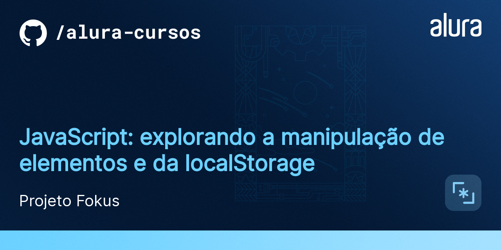
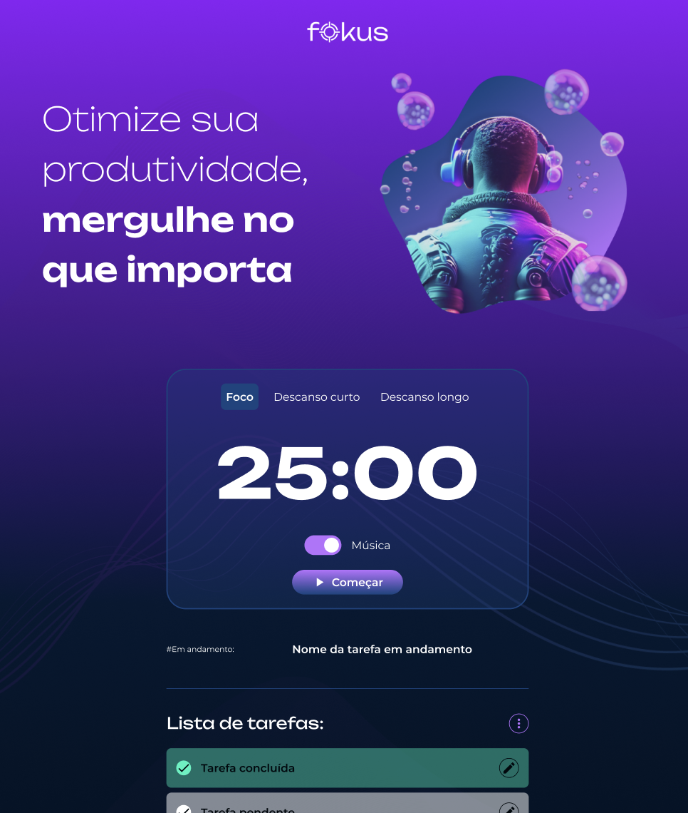

# Fokus

Olá! 👋  
Este projeto foi **desenvolvido e finalizado** como parte do curso  
**"JavaScript: explorando a manipulação de elementos e da localStorage"**,  
com o objetivo de consolidar conceitos fundamentais de JavaScript na prática.

Ao longo do desenvolvimento, a aplicação evoluiu de uma página estática para uma **aplicação web funcional**, focada no gerenciamento de tarefas.

---

## 📌 Sobre o Projeto

O **Fokus** é uma aplicação web simples e interativa que permite ao usuário **gerenciar tarefas de forma prática**, oferecendo uma interface limpa e intuitiva.

O projeto foi utilizado como base para aplicar conceitos importantes como **manipulação da DOM**, **eventos JavaScript** e **persistência de dados com localStorage**.

---

## 🚀 Funcionalidades Implementadas

- ✅ **Adicionar tarefas** por meio de um formulário dinâmico  
- ✏️ **Editar tarefas existentes**  
- 👀 **Visualizar todas as tarefas criadas**  
- ✔️ **Marcar tarefas como concluídas**, com alteração visual  
- 🗑️ **Remover tarefas concluídas** ou limpar a lista completamente  
- 💾 **Persistência de dados com localStorage**, mantendo as tarefas salvas mesmo após recarregar a página  

---

## 🛠️ Tecnologias e Conceitos Utilizados

- **JavaScript (ES6+)**
- **Manipulação da DOM**
- **Eventos JavaScript**
- **LocalStorage**
- **HTML5**
- **CSS3**

Este projeto foi essencial para reforçar o entendimento de como o JavaScript interage com o HTML e o CSS em aplicações reais.

---

## ▶️ Como Executar o Projeto

Não é necessário instalar dependências.

### Passo a passo:

1. Faça o download ou clone este repositório
2. Abra a pasta do projeto
3. Execute o arquivo `index.html` em qualquer navegador moderno  
   (Google Chrome, Firefox, Edge, etc.)

Pronto! 🎉 A aplicação estará funcionando.

---

## 📂 Estrutura do Projeto

Os principais arquivos são:

- `script-crud.js` → Implementação das operações de **CRUD** das tarefas  
- `script.js` → Funcionalidades adicionais do projeto  
- `styles.css` → Estilização completa da aplicação  

---

## 🎯 Objetivo do Projeto

Este projeto marca a **conclusão do curso** e representa um passo importante no meu aprendizado em JavaScript, servindo como base para projetos mais complexos no futuro.

Sugestões e melhorias são sempre bem-vindas! 🚀

---

